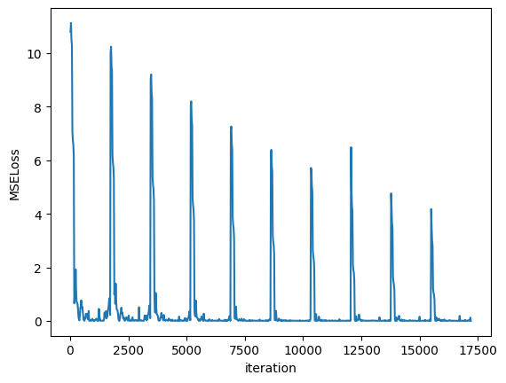
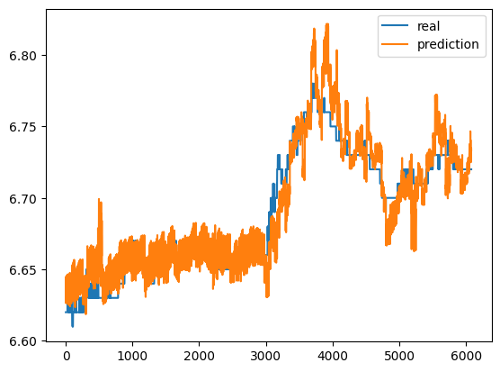
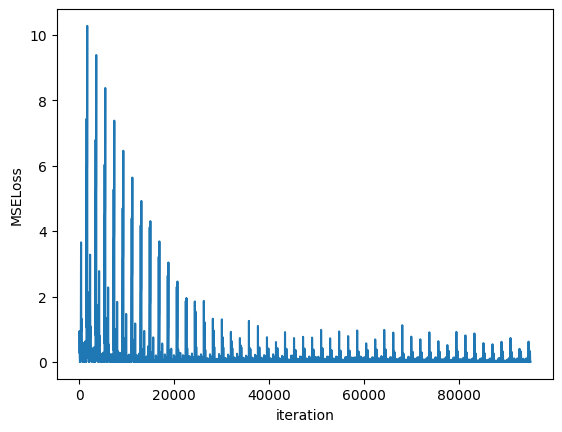
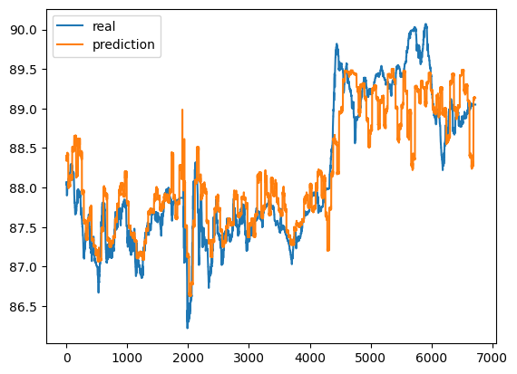

# 股市订单数据分析

## Order Book

订单簿(Order Book)是一个关键的金融市场工具，详细记录了市场参与者的买卖订单。一个完整的订单簿包含了买卖双方的价格、数量以及订单的时间戳。在这部分，我详细列出了2020年1月10日09:30:00，10:30:00以及13:30:00这三个时刻每只股票的订单簿信息。我特别关注买卖两个方向最优的前10档的挂单价格和挂单量。

我维护了一个order_book数据簿，存储目前市场上买方和卖方所有的未成交订单，其中限价单直接存储挂单价格，而市价单若指定为本方最优，则查询当前order_book数据簿中本方的最优价格，存储为挂单价格，若是其他类型的市价单，则查询order_book中对方的最优价格，作为挂单价格，而即时成交撤销类型的市价单会在成交和撤单时自动处理订单信息。

处理订单信息至要求的时间戳时，我将order_book数据簿中买方/卖方各自最高/最低10档的挂单价格与该价格尚未成交的挂单量记录在该时间戳的Order Book中，其中相同挂单价格的不同订单的挂单量求和，表示该价格下的剩余可成交量。

Order Book保存在order_book文件中，样例格式为：

> Stock Code: 000069  
> Order book at 2020-01-10 09:30:00  
> Bid side:  
> | Price | Order Qty |
> |-------|-----------|
> | 7.78  | 116300.0  |
> | 7.77  | 249200.0  |
> | 7.76  | 1500.0    |
> | 7.75  | 23700.0   |
> | 7.74  | 293700.0  |
> | 7.73  | 95500.0   |
> | 7.72  | 29400.0   |
> | 7.71  | 52000.0   |
> | 7.70  | 27600.0   |
> | 7.69  | 129100.0  |
>
> Offer side:  
> | Price | Order Qty |
> |-------|-----------|
> | 7.79  | 128200.0  |
> | 7.80  | 104413.0  |
> | 7.81  | 6100.0    |
> | 7.82  | 97600.0   |
> | 7.83  | 101300.0  |
> | 7.84  | 74000.0   |
> | 7.85  | 69000.0   |
> | 7.86  | 17000.0   |
> | 7.87  | 64700.0   |
> | 7.88  | 13700.0   |

## order_book.py

## 股票价格预测

我认为在交易时较为重要的价格数据为当前时间戳买方和卖方的最优价格，因为一种可行的交易策略是以尽可能最优的价格尽快成交，而这种策略需要知道双方的最优价格。而观察数据时我发现通常买方最高价和卖方最低价只差了一分，几乎和两者中间价差不多，所以我在这个问题中选择了买方最高价为我希望预测的价格。具体地说，我选取的P(t)为Order Book上在t时间戳，买方挂单的最优价格。

确定时间尺度之前我尝试了一些不同时间尺度的预测，包括以天为单位预测收盘价，以及以小时为单位进行预测。在这个项目中我选择将时间尺度定为H=3s，因为我认为每3s一个快照的价格预测更加精细，且数据量更大，在实时交易中能更快检测到价格波动。

我在项目中使用机器学习进行预测，我尝试的机器学习模型为LSTM和Transformer，具体的预测任务为根据当前时刻t+H前SEQ_LEN个快照的Order Book信息预测P(t+H)。其中在预测值的选择上，我尝试直接预测价格变化率 P(t+H) / P(t) - 1，但预测效果一般，我认为原因是时间尺度为3s的价格变化率几乎都是零，在这个尺度上价格波动不显著。

我将每支股票的挂单信息维护成一个动态的Order Book，其中用来预测的特征值为，至该时刻买卖双方的最优价格，Bid price, Offer price，与该价格当前可成交的挂单总量，Bid quantity, Offer quantity。为了简化预测模型，除了最优价格外我只使用了各自的挂单量这两个特征，因为我认为买方和卖方在最优价格的挂单量变化可以反应出价格的变化趋势，比如卖方的最低价挂单量如果减小且比买方最高价挂单量要显著少，直觉上买方最高价就会上升。

在数据预处理阶段，我将这四个特征值分别进行了Z-Score标准化。我尝试了对Bid quantity和Offer quantity进行特征预处理，将每一个快照的quantity减去了上一个快照的quantity，记录H时间内的最优价成交变化量为训练的特征值，但这样处理之后对训练效率并没有明显的影响，而且最优价变化时，这个差值没有意义。模型中我使用MSELoss衡量预测的loss，即预测值与真实值的均方差。

## 预测结果

由于3s一张快照的数据比较密集，1.10至7.9的全部订单快照都处理出来的话数据量比较庞大，且维护Order Book的耗时比较长，因此我从给出的六个月的数据中维护了一个月左右的Order Book进行训练。我处理了000069号股票从1.23至2.19的订单数据，并按照9：1分割为训练集与测试集。我取SEQ_LEN为49，即通过前49个Order Book快照内147s的交易信息，预测下一个3s快照的买方最优一档价格。通过对Transformer模型进行了10 Epoch的训练，模型对测试集的预测效果为MSELoss=0.00658。根据train_loss下降曲线看，10个Epoch还没有达到收敛，理论上多跑几个epoch可能会有更好的预测结果（因为我在Colab上用GPU有使用限制，没有进一步尝试）

对于更大的数据集，模型的预测效果不那么好，我尝试处理出000069号股票从1.10至3.26的数据，但模型的收敛速度很慢，经过10个Epoch后train_loss波动仍然很大，测试集预测结果显示近乎为一条直线，虽然能够预测到一些剧烈的价格变化。对于更小的数据集，模型也无法给出很好的预测，比如002304号股票1.10-1.13三天的数据，模型似乎提取不出有用的特征信息，预测效果在MSELoss=0.3左右波动。

我类似地处理了000566、000876、002304、002841、002918号股票数据，对于其中的一些股票数据，模型可以较快的收敛，但收敛后的loss仍然不低。比如模型在002918号股票从1.10至2.6的数据上得到的预测效果为MSELoss=0.0242，我训练了50个Epoch，发现在接近20个Epoch左右train_loss已经基本收敛了，因此这应该已经达到模型预测表现的上限。

## 误差和改进策略

我认为目前的模型可以在以下方面进行改进：

- 目前的模型用于预测的特征数据非常简单粗暴，只有买卖双方的最优一档价格和对应的挂单量。除了这四个维度之外，还可以引入其他的参数来预示价格的波动。比如最优的第二档价格，当买卖双方的最优价发生波动时，上一个快照的次高（低）价可以指示这个时刻可能的最优价。而且观察Order Book可以发现，次高（低）价对应的挂单量通常都会大于最高（低）价的挂单量，因此次优价格的挂单量变动可能对价格波动更敏感。

- 通过维护的Order Book信息预测本身可能就丢失了一部分特征，3s内交易双方的挂单信息和成交信息也会指示价格变化————比如该时刻附近成交的价格分布与限价单的价格分布更靠近买方最高价还是卖方最低价。因此我可以将预测时刻前最新成交的SEQ_LEN条价格与成交量也作为特征信息，或者将最新挂单价格最优的单个订单的挂单量作为特征信息。对于000069号股票，我尝试了用后者替代了Bid/Offer quantity，模型收敛的速度的确显示出一些提升。

- 数据预处理部分，我发现预测值（价格）在训练集和测试集的分布有比较大的漂移，这是因为训练集和测试集的数据横跨了一个月左右。但由于我的时间尺度为3s，在这个时间尺度下通常价格波动都很不明显，局部会有剧烈的价格变化。数据集分布的漂移导致训练出来的模型在测试集做出的短时间的预测表现不佳，因此当数据集较大，时间跨度为将近三个月时，模型预测效果很差。一个可能的改进方式是将预测值调整为价格变化率，但在H较小的任务中变化率的分布远远偏离正态分布，因此需要进行对数变换之类的特征处理才能获得更好的表现。

- 对这四个参数进行一些conditional的特征工程可能也会改进模型的表现。仅仅对单列特征做标准化或者差分可能没法获得特征联合的信息，比如在买方价格上升、维持不变或者下降这三种不同的情况下，不同的挂单量数据对价格变化有不同的敏感度————买方价格上升，则新的买方最优价对应的挂单量反映买方当前需求量；买方价格不变，快照间隔的买方挂单量变化可能更敏感；买方价格下降，说明原先的最优价挂单已经成交，那么比较合理的特征应该是新的最优价挂单量与上一快照次优价挂单量的差。

- 除此之外，可能也可以调整预测任务，比如SEQ_LEN可以尝试用更短的，30s内的订单信息。我在模型中还缺少数据清洗的步骤，因为H=3s的预测只有在连续竞价期间才有意义，一些跨天的序列信息不应该参与训练和预测。由于Colab的使用限制，我没能对所有的改进策略进行足够的尝试。
